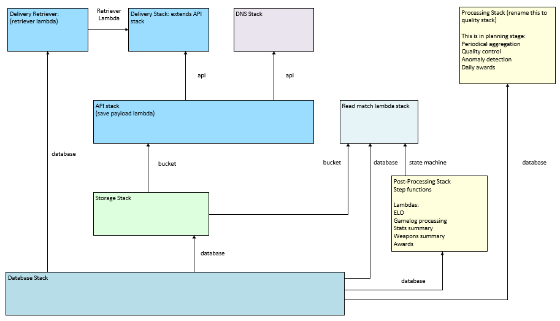

# CDK Python project rtcwprostats

It's best if you know some CDK before trying your luck here.

### General CDK instructions

**First time** : To manually create a virtualenv on **MacOS and Linux**:

```
$ python -m venv .venv
```

**First and all subsequent times**: After the init process completes and the virtualenv is created, you can use the following
step to activate your virtualenv.

```
linux: $ source .venv/bin/activate
windows: % .venv\Scripts\activate.bat
```

**First time:** Once the virtualenv is activated, you can install the required dependencies.

```
$ pip install -r requirements.txt
```

At this point you can now synthesize the CloudFormation template for this code.

```
$ cdk synth
```

To add additional dependencies, for example other CDK libraries, just add
them to your `setup.py` file and rerun the `pip install -r requirements.txt`
command.

## Useful commands

 * `cdk ls`          list all stacks in the app
 * `cdk synth`       emits the synthesized CloudFormation template
 * `cdk deploy`      deploy this stack to your default AWS account/region
 * `cdk diff`        compare deployed stack with current state
 * `cdk docs`        open CDK documentation

### Helpful setup hints
Python, npm, cdk may not add to your PATH automatically
next time you start CMD you can either run these commands or script them into a file:

If needed add python to windows PATH
```
	set PATH=%PATH%;C:\Users\\<USERNAME>\AppData\Local\Programs\Python\Python38_this_may_be different
	set PATH=%PATH%;C:\Users\\<USERNAME>\AppData\Roaming\npm
	cdk --version
	cd \\<PATH TO GITHUB FOLDER>\Github\rtcwprostats
	.venv\Scripts\activate.bat
```
	
later you will use these
	
```
	cdk  synth
	cdk deploy -e StackName
	cdk deploy -v --profile user2 --all --require-approval never
    cdk destroy --all
```
### CDK instructions specific to this project
At the time of writing the infrastructure if broken down into these logical areas:


More logical view of the stacks is this



