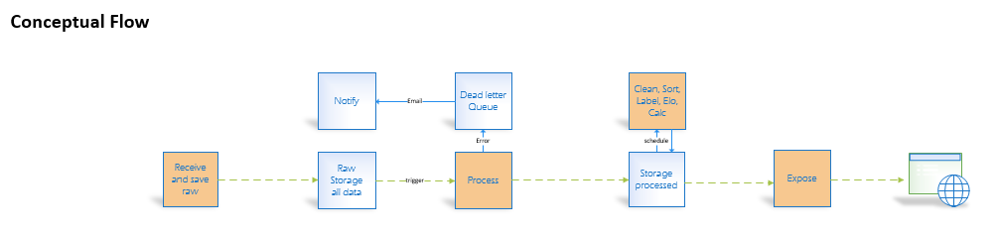
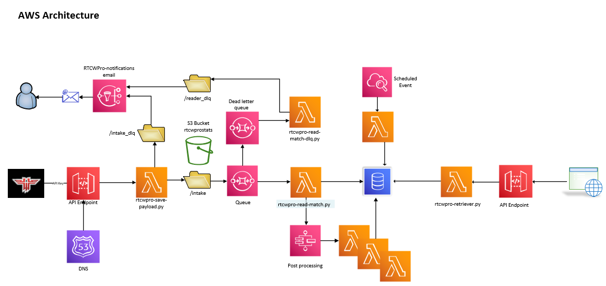
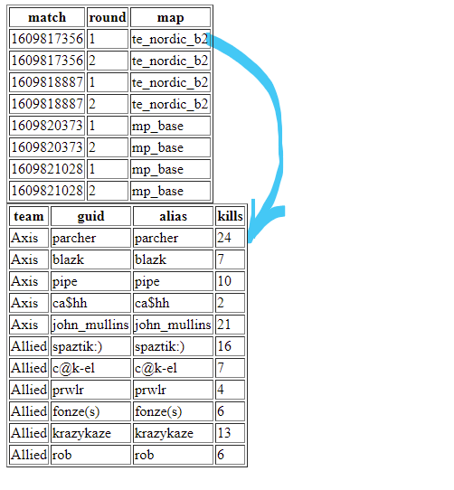

## ----
## project moved to the rtcwpro organization
## https://github.com/rtcwmp-com/rtcwprostats
## what remains here is a personal archive
## ----

# RTCWPro Stats developer doc

This project is build to collect RTCWPro stats submitted by servers after the end of each round. The solution is built in a modern pipeline design fashion where data is:
1. Ingested -> retained
2. Pre-processed -> stored
3. Cleansed/tagged/post processed
4. Exposed to final consumer via REST API

## Architecture
**Conceptual flow**


**Technical architecture**


The project relies on AWS CDK framework that allows deploying infrastructure as code(IaC).
This way all deployed resources (storgaes, databases, jobs) are robustly controlled, versioned, and easily replicated. 

## Pipeline components
* RTCW Pro servers submit the end round stats to the ingestion API
* **Save_payload** lambda python job accepts the json payload and stores it in permanent file raw storage
* Event driven **read-match** lambda python job picks up the incoming file and with minimal processing puts it into the database
* A series of sequential lambda python jobs process the results, perform calculations, elo, awards, etc **<-- crowdsourcing potential here**
* Rest of the API uses the **Retriever** lambda python job to process end user requests to return json with players, matches, stats, elo, etc. Work in progress
* Web/discord/rtcwpro developers consume the API to build applications

## Outputs 
End users (app developers and final consumers) have access to the following APIs
https://rtcwproapi.donkanator.com/matches/16098173561
* rtcwproapi.donkanator.com is API domain
* and /matches/16098173561 is API path represented below as /matches/{match_round_id}

The contents of the json should be mostly familiar to anyone with RTCW game knowledge.
Extra fields specific to this project: 
match_type represented with string <region>#<type> - ex. na#6 is north america 6v6
jsonGameStatVersion - RTCW Pro version of json

Important difference to keep in mind - matches and gamelogs are identified by {match_round_id}, and stats and wstats are identified with {match_id}. Example: 
/match/16098173561 is match 1609817356 round 1
/stats/1609817356 comes wihout "1" at the end.

The following APIs are available at the time of writing this documentation:
x is done , / is work in progress, blank is planned

|Status  |Domain  |API Path  |Query  |
|-------- |-------- |-------- |--------|
|[x] |Matches |/matches/{match_round_id_1},{match_round_id_N} |Get match info(s) |
|[x] |Matches |/matches/type/{region}/{type} |Filter type of matches by region (sa na eu, unk) and type(3,6,6plus) |
|[x] |Matches |/matches/recent |Filter by last 30 days to get matches |
|[x] |Matches |/matches/recent/{days} |Filter by last x days to get recent matches |
|[x] |Matches |/matches/server/{begins_with} |Get 100 recent matches from a server |
|[x] |Gamelog |/gamelogs/{match_round_id} |Retrieve game log for a match |
|[x] |Stats   |/stats/player/{guid} |Filter stats for a player guid from many matches |
|[x] |Stats   |/stats/player/{player_guid}/region/{region}/type/{type} |Filter stats for a player/region/type |
|[x] |Stats   |/stats/{matchid} |Filter stats for a match or range of matches |
|[x] |Weapons |/wstats/{matchid} |By match retrieve all wstats |
|[x] |Weapons |/wstats/player/{player_guid}/match/{matchid} |By player by match |
|[x] |Weapons |/wstats/player/{player_guid} |By player by several matches |
|[x] |Players |/player/{player_guid} |Filter by given guid to get player info |
|[x] |Players |/player/search/{begins_with} |Search for real names that start with a string |
|[x] |Servers |/servers |Get list of all servers with stats |
|[x] |Servers |/servers/detail |Same, but with details |
|[x] |Servers |/servers/region/{region} | Get server list by region |
|[x] |Servers |/servers/region/{region}/active |Same, but with 30 days since last submission |
|[x] |Groups  |/groups/add (POST)| Add a group of matches|
|[x] |Groups  |/groups/group_name/{begins_with} |Get groups that begin with partial word|
|[x] |Groups  |/groups/region/{region}|Get groups that were marked with a region|
|[x] |Groups  |/groups/region/{region}/type/{type}|Get groups that were marked with a region and type|
|[x] |Groups  |/groups/region/{region}/type/{type}/group_name/{begins_with}|...and partial name|
|[x] |Leaders |/leaders/{category}/region/{region}/type/{type}/limit/{limit}| Leaderboards. Categories:elo, kdr, acc|
|[x] |Elo prog.|/eloprogress/match/{match_id}| Elo progress for players in a given match|
|[x] |Elo prog.|/eloprogress/player/{player_guid}/region/{region}/type/{type}| Elo progress for a player|
|[x] |Aliases  |/aliases/search/{begins_with}| Get guids for partial alias match|
|[x] |Aliases  |/aliases/player/{player_guid}| Get aliases for a player|
|[x] |Aliases  |/aliases/recent/limit/{limit}| Get last x seen aliases |


Example:

### Matches
https://rtcwproapi.donkanator.com/matches/recent/92 will (maybe) give match 16098173561, therefore stats and wstats will follow:

https://rtcwproapi.donkanator.com/matches/type/na/6
note: idenitifying server region is done by some server name parts or manually

https://rtcwproapi.donkanator.com/matches/server/virg

### Stats
https://rtcwproapi.donkanator.com/stats/1609817356

https://rtcwproapi.donkanator.com/stats/group/gather15943

https://rtcwproapi.donkanator.com/stats/player/ecfc385510bbbaa564f8b6cfd4c68f61/region/na/type/6

### Wstats
https://rtcwproapi.donkanator.com/wstats/1609817356

https://rtcwproapi.donkanator.com/wstats/player/A53B3ED2A896CB/match/1609817356

### Player
https://rtcwproapi.donkanator.com/player/01cf12e8114d67c45142e0f62cd24628#1626146020

https://rtcwproapi.donkanator.com/player/search/donk

### Server

https://rtcwproapi.donkanator.com/servers

https://rtcwproapi.donkanator.com/servers/region/na

https://rtcwproapi.donkanator.com/servers/region/na/active

### Groups

https://rtcwproapi.donkanator.com/groups/add (POST)

https://rtcwproapi.donkanator.com/groups/group_name/gather15943

https://rtcwproapi.donkanator.com/groups/region/na/type/6

https://rtcwproapi.donkanator.com/groups/region/na/type/6/group_name/gather15943

### Leaderboards

https://rtcwproapi.donkanator.com/leaders/elo/region/na/type/6/limit/10

https://rtcwproapi.donkanator.com/leaders/acc/region/eu/type/3/limit/10

https://rtcwproapi.donkanator.com/leaders/kdr/region/sa/type/6/limit/10

### Aliases

https://rtcwproapi.donkanator.com/aliases/player/22b0e88467093a63d5dd979eec2631d1

https://rtcwproapi.donkanator.com/aliases/search/donk

https://rtcwproapi.donkanator.com/aliases/recent/limit/3

### Elo progress

https://rtcwproapi.donkanator.com/eloprogress/player/22b0e88467093a63d5dd979eec2631d1/region/na/type/6

https://rtcwproapi.donkanator.com/eloprogress/match/1632108123


## Usage 
* Familiarize yourself with what's available in the API section
* API is open to anyone
* Work from /matches down to /stats by match_id or player_guid
* Assume jsonGameStatVersion may change and new fields may appear
* Assume {error: "error message"} can be returned

## Example
Let's say matches/recent API returns the following JSON
```
[
    {
        match_id: "1609817356",
        round: "1",
        round_start: "1609817356",
        round_end: "1609818109",
        map: "te_nordic_b2",
        time_limit: "10:00",
        allies_cycle: "21",
        axis_cycle: "30",
        winner: " ",
        jsonGameStatVersion: "0.1.2",
        type: "na#6",
        match_round_id: "16098173561"
    }
.....
]
```
From here you can make a link to stats or wstats. Just make sure you don't use round# at the end
https://rtcwproapi.donkanator.com/stats/1609817356
```
{
statsall: [
    {
        A53B3ED2A896CB: {
            alias: "parcher",
            team: "Axis",
            start_time: 6788350,
            num_rounds: 1,
            categories: {
                kills: 24,
                deaths: 6,
                gibs: 5,
                suicides: 6,
                teamkills: 2,
                ....
```

Example javascript can be found here. See source:
https://s3.amazonaws.com/donkanator.com/forever/get_matches.html


The rest depends on web implementation. Keep track of available APIs or make suggestions as you see fit.


## Contribution to the pipeline
There's plentry of potential to contribute. Currently looking for post-processing calculations for:
* gamelogs insights
* stats aggregation
* wstats aggregation
* more APIs
* ELO 

https://rtcwproapi.donkanator.com/gamelogs/16098173561
https://rtcwproapi.donkanator.com/stats/1609817356
Can you make sense of these events? Can you come up with a plan to process json and store results?
Can you work towards making your results available to final consumer?

### Where to start:
The project currently uses python, but I'm open to Java, Go, PowerShell, Node. js, C#, Python, and Ruby, as long as you are willing to support it.
* Understand what you want to do: final consumer presentation or inner pipeline calc
* Save or call a particular API like https://rtcwproapi.donkanator.com/gamelogs/16098173561
* Ingest JSON and do your thing
* Make a plan what needs to be saved/cached

## My commitment
One of the main points of this project is to channel rtcw data to app consumers - front-end developers, discord bots, etc. It is of outmost importance to me to:
* keep existing functionality from breaking
* communicate new features
* ensure upstream application uptime

Below you will find a log of API fixes/additions.

If you are an API consumer, please do your part:
* subscribe to commits https://github.com/donkz/rtcwprostats/watchers
* talk to me on discord https://discord.com/invite/SSSZDGa
* open an issue https://github.com/donkz/rtcwprostats/issues

## ChangeLog
(see full documentation and example URLs above)
* add: /player/search/{begins_with}
* fix: /matches/recent - sort descending
* add: /matches/server/{begins_with}
* add: /servers and /servers/detail
* fix: player json had elo values resetting every time the player played a different match type
* add: /matches/type/{region}/{type}
* add: started work on /groups - this will contain matches that relate to an event
* add: /groups/add (POST)
* add: /groups/group_name/{group_name}
* add: /groups/region/{region_name}
* add: /groups/region/{region_name}/type/{match_type}
* add: /groups/region/{region_name}/type/{match_type}/group_name/{group_name}
* add: /stats/{match_id} with csv match_ids
* add: /servers/region/{region}
* add: /servers/region/{region}/active
* add: used new api in server POC page https://s3.amazonaws.com/donkanator.com/forever/get_servers.html?region=eu&active=yes
* add: discord webhook reporting 
* fix: redo table structure behind players. /player/search/{begins_with} should not be affected /player/{player_guid} is changing.
* add: /leaders/{category}/region/{region}/type/{type}
* add: /aliases/search/{begins_with}
* add: /aliases/player/{player_guid}
* add: /eloprogress/player/{player_guid}/region/{region}/type/{type}
* add: /eloprogress/match/{match_id}
* fix: redo db schema for recording aliases. Previous /aliases/* functions should not be affected.
* add: /aliases/recent/limit/{limit}
* add: group summary calculation driven by group submission
* add: /stats/group/{group_name}
* remove: /stats/{csv of matches} (replaced by grouping functionality)
* remove: /stats/{game_type} (no use cases)
* add: match_summary element describing rounds, wins, and durations under /stats/xx
* fix: Include ELO +/- info into discord notifier
* fix: Fix wstats aggregation to include better number of games
* fix: Don't summarize all stats keys (efficiency, accuracy, killpeak)
* fix: player/{player_guid} was not returning wstats
* add: /stats/player/{player_guid}/region/{region}/type/{type} and corresponding changes to the db
* fix: sorted groups by added date
* fix: grouping summarization errors
* add: teams to match info

